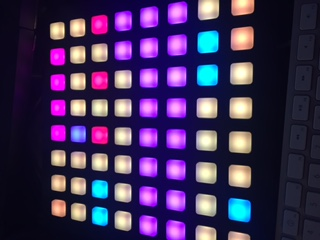

#sniffeal : A scanner interface for the BHOREAL LED matrix.

sniffeal is a network interface scanner that uses the [BHOREAL](http://bhoreal.com/) MIDI controller, for cool educative purposes.
The color depends on the IP packet port, so you can see the actual HTTP, FTP, IRC... flow of a computer.
You can also visually check if all packets are going through your favorite VPN !

The repo also contains a BHOREAL MIDI emulator that runs on your computer, for testing purposes.

sniffealmidi.py depends on [Scapy](https://github.com/secdev/scapy/) and [Mido](https://mido.readthedocs.io/).
The emulator depends on [Mido](https://mido.readthedocs.io/) and [wxPython](https://wxpython.org/).

Both scripts are wiitten and tested for Python 2.x.

If sniffealmidi.py throws Scapy errors, the [pypcap](https://pypi.python.org/pypi/pypcap) module might fix them.
To change the network interface to scan, edit the last line of sniffealmidi.py and replace en0 with your interface.

**NOTE: The following part of the README is about the old OSC/Pure Data version of sniffeal.**

Run :

Launch bhoreal.pd in Pure Date
sudo python sniffealosc.py

Sniffealosc send led commands as OSC messages to bhoreal.pd

bhoreal.pd is an OSC <-> MIDI translator for Bhoreal.
/bhoreal/in 
/bhoreal/out
/bhoreal/rgb 
/bhoreal/led
 
Termeal is the loloster version that does square colors inside the terminal. Check the arguments there https://github.com/loloster/termeal

